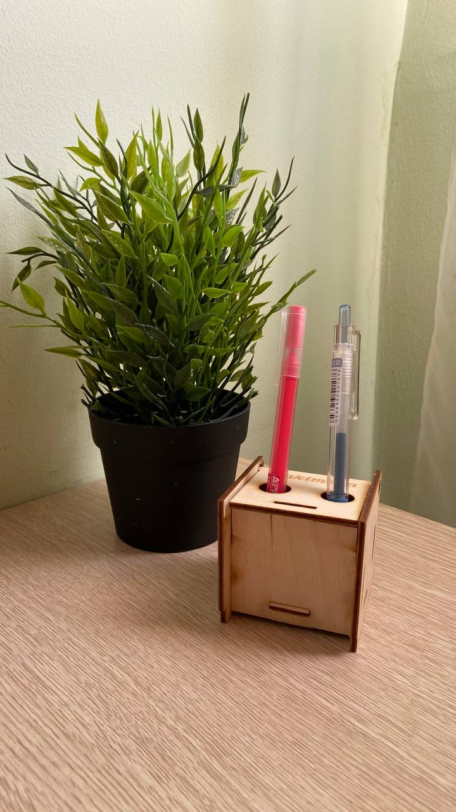

# Box
**Маленький органайзер для ручек своими руками**
*******************
**План работы**

1.Открыть [сайт](https://cy1505.tmweb.ru) и выбрать нужный чертеж ;

2.Обработка выбранного чертежа с помощью CorelDraw ;

3.Подготовка лазерного станка к работе ;

4.Лазерная резка детала ;

https://github.com/madinakhakimova/Box/assets/144451345/a2564785-e023-43b2-ade7-d4278c9c3d08

5.Сборка детала .

https://github.com/madinakhakimova/Box/assets/144451345/d4ad4447-9691-4333-bb02-8d28a4c1cb7c

*По шаговая инструкция по запуске лазерного станка :*

1.Включить вытяжную систему ;

2.Включит лазерный станок ;

3.Разместит материал(лист фанер) в рабочей область ;

4.Настроит настройки для корректной печати ;

5.Нажать кнопку Star/Stop на панели управления

*В лазерном станке можно обрабатывать:*

  - фанера;
  
  - бумага;
  
  - картон;
  
  - дерево;
  
  - некоторые виды пластиков (акрил, например);
  
  - кожа;
  
  - ткань.

  **Готовая работа :** 

  
